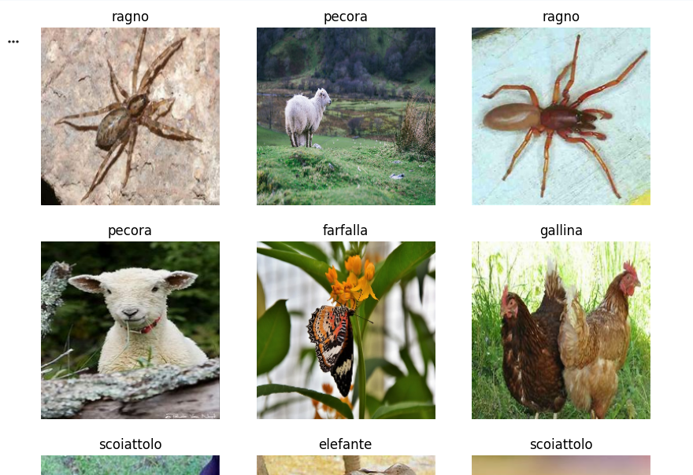
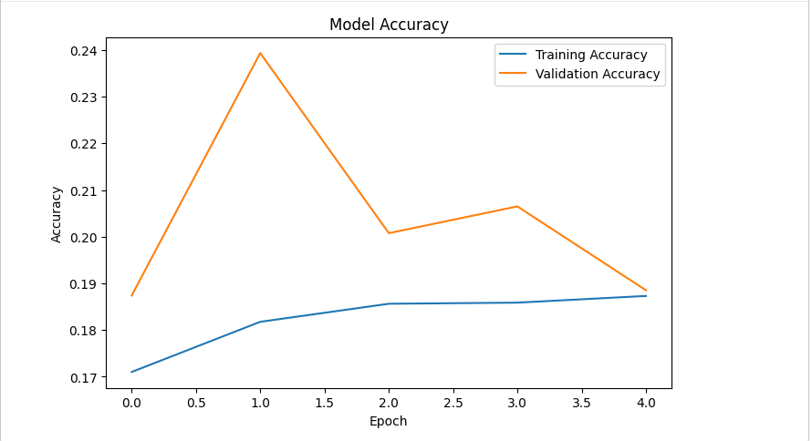
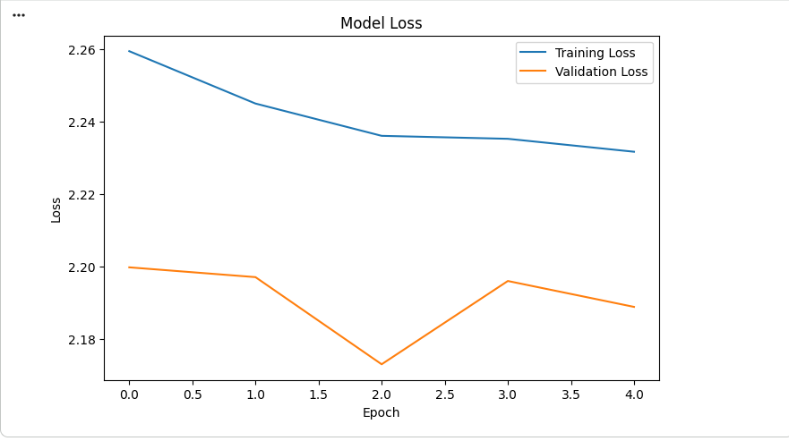
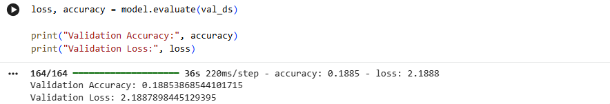

# Animal Image Classification using EfficientNetB7

## Overview

This project implements an Animal Image Classification system using the EfficientNetB7 deep learning architecture and TensorFlow. The model is trained on the Animals-10 dataset to classify images into 10 different animal categories.

The project demonstrates the application of transfer learning, image preprocessing, model training, evaluation, and prediction using a state-of-the-art convolutional neural network.

---

## Features

* Animal image classification using EfficientNetB7
* Transfer learning with ImageNet pre-trained weights
* Automated image preprocessing
* Training and validation dataset split
* Model evaluation using accuracy and loss metrics
* Prediction of animal classes from images
* Visualization of training performance

---

## Dataset

The project uses the Animals-10 dataset, which contains images of:

* Dog (cane)
* Horse (cavallo)
* Elephant (elefante)
* Butterfly (farfalla)
* Chicken (gallina)
* Cat (gatto)
* Cow (mucca)
* Sheep (pecora)
* Spider (ragno)
* Squirrel (scoiattolo)

---

## Technologies Used

* Python
* TensorFlow
* Keras
* EfficientNetB7
* NumPy
* Matplotlib
* Google Colab

---

## Project Workflow

1. Dataset Collection
2. Data Preprocessing
3. Image Resizing and Normalization
4. Training and Validation Split
5. EfficientNetB7 Model Development
6. Model Training
7. Model Evaluation
8. Prediction and Classification
9. Result Visualization

---

## Model Architecture

The classification model consists of:

* EfficientNetB7 (Pre-trained on ImageNet)
* Global Average Pooling Layer
* Dropout Layer
* Dense Output Layer with Softmax Activation

Transfer learning is used to improve classification performance while reducing training time.

---

## Results

The model was successfully trained and evaluated on the Animals-10 dataset.

### Dataset Sample Images



### Accuracy Graph



### Loss Graph



### Prediction Results



---

## How to Run

1. Clone the repository

```bash
git clone https://github.com/your-username/Animal-Image-Classification-EfficientNetB7.git
```

2. Open the notebook in Google Colab or Jupyter Notebook.

3. Install the required libraries

```bash
pip install tensorflow numpy matplotlib
```

4. Run all notebook cells sequentially.

5. Train and evaluate the model.

---

## Future Enhancements

* Real-time animal detection using webcam
* Web application deployment using Streamlit
* Mobile application integration
* Support for additional animal categories
* Model optimization for faster inference

---

## Conclusion

This project demonstrates the effectiveness of EfficientNetB7 and transfer learning for animal image classification. The trained model successfully classifies images across ten animal categories and provides a practical example of deep learning in computer vision.

---

## Author

Anushitha R


